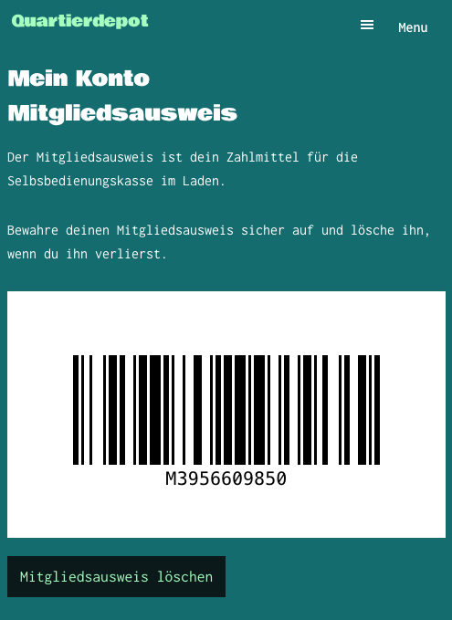

# Quartierdepot Member ID

A WordPress plugin that adds shows a `member_id` field as barcode on the url `/my-account/memberid`. 
The plugin allows users to generate and manage their membership ID, which is displayed as a barcode in their account area.

*Member ID page when no barcode is generated yet*

*Member ID page showing the generated barcode*

## Features

- Displays membership ID as a Code-128 2D barcode using JsBarcode
- Generates unique membership IDs in the format `MXXXXXXXXXX` (where X is a random digit)
- Allows users to delete their membership ID
- Integrates with WooCommerce's "My Account" area

## Prerequisites

- WordPress 5.8 or higher
- PHP 7.4 or higher
- WooCommerce plugin
- Advanced Custom Fields (ACF) plugin

## Installation and Required Configuration

1. Install Plugin
  - Download the latest release ZIP file from the [Releases page](https://github.com/quartier-depot/quartierdepot-memberid/releases)
  - Go to WordPress admin → Plugins → Add New
  - Click "Upload Plugin" and select the downloaded ZIP file
  - Click "Install Now" and then "Activate"
  - Activate the plugin through the 'Plugins' menu in WordPress
3. Set up the required ACF field:
   - Go to Custom Fields in WordPress admin
   - Create a new field group
   - Add a new field with these settings:
     - Field Label: Member ID
     - Field Name: member_id
     - Field Type: Text
     - Location Rules: User Form is equal to All
     - Required: No
     - Read Only: Yes
4. (Optional) Add the membership ID page to your WooCommerce account menu:
   - Go to WooCommerce → Settings → Advanced
   - Under "Account endpoints", add:
     - Endpoint: memberid
     - Label: Mitgliedsausweis
5. (Optional) Add the membership ID page to your menu:
   - Go to WooCommerce → Appearance → Menus
   - Under "My account page", add:
     - Custom link pointing to `/my-account//memberid`

## Usage

Once installed and configured, users can access their membership ID through their WooCommerce account area. The URL will be
`/my-account/memberid/` (or whatever your WooCommerce account page slug is, followed by `/memberid/`).

The page allows users to:
- View their current membership ID as a barcode
- Generate a new membership ID if they don't have one
- Delete their existing membership ID

## Security

- All actions are protected by WordPress nonces
- Only logged-in users can access the membership ID functionality
- Each membership ID is unique across all users

## Release

1. `git tag 0.0.1`
2. `git push origin --tags`